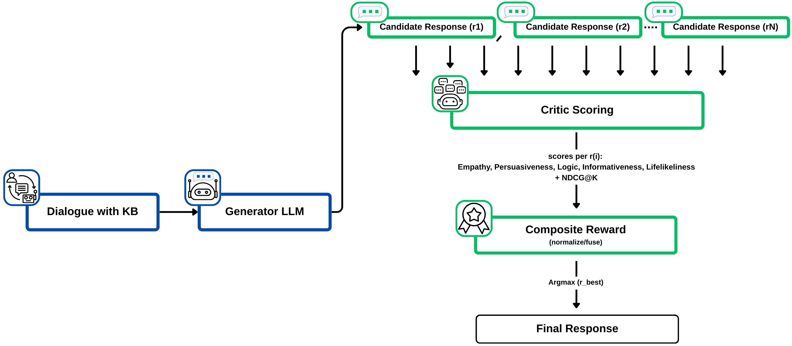
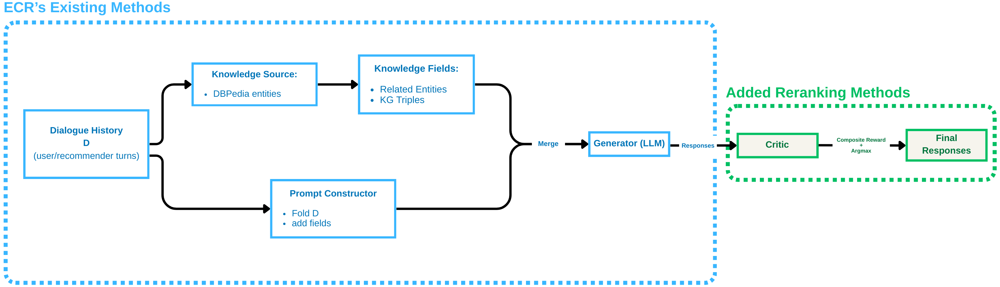

# ECR-RR: Empathetic Conversational Recommender with Critic-based Reranking

This project contains the complete implementation of an **inference-time reranking system** for empathetic conversational recommendation (ECR: https://github.com/zxd-octopus/ECR), featuring a RoBERTa-based critic for response quality assessment and NDCG-balanced evaluation.

## Project Overview

This project implements an **inference-time reranking approach** that:
- Generates multiple candidate responses using Llama2-7B-Chat
- Uses a trained RoBERTa critic to score responses on five subjective dimensions
- Combines subjective scores with NDCG@K for recommendation alignment
- Selects the best candidate through composite reward optimization


*Figure 1: High-level selection pipeline. Blue boxes denote ECR's existing flow (dialogue/knowledge → generator); green boxes denote our reranking modules (candidates, critic scoring, composite reward). The generator proposes multiple candidates; a critic scores each candidate per subjective dimension and with NDCG; the composite reward selects the highest-reward candidate.*


## Repository Structure

```
ECR-RR/
├── configs/                          # Configuration and data files
│   ├── config.py                     # Main configuration settings
│   ├── item_ids.json                 # Movie item ID mappings
│   ├── movie_reviews_processed_train.json  # Processed training reviews
│   └── movie_reviews_processed_valid.json  # Processed validation reviews
├── data_processing/                  # Data preprocessing and scoring
│   ├── convert_and_score_full_dataset.py  # Convert and score datasets with LLMs
│   ├── merge.py                      # Merge multiple dataset files
│   ├── merge_rec.py                  # Merge recommendation data
│   ├── process.py                    # General data processing
│   ├── process_empthetic.py          # Process empathetic dialogue data
│   └── process_mask.py               # Process masked data
├── docs/                             # Documentation and thesis
│   ├── DRAFT_THESIS_REPORT.tex      # Complete thesis document (963 lines)
│   ├── README.md                     # This documentation file
│   └── references.bib               # Bibliography references
├── images/                           # Project figures and diagrams
│   ├── selection_pipeline.png       # High-level selection pipeline diagram
│   └── system_architecture.png      # System architecture with clustered components
├── evaluation/                       # Model evaluation scripts
│   ├── ecr_eval_runner.py            # ECR evaluation runner
│   ├── evaluate_ecr_comprehensive.py # Comprehensive ECR evaluation
│   ├── evaluate_ecr_proper.py        # Main ECR evaluation (AUC, Recall, NDCG)
│   ├── evaluate_rl_ecr_proper.py     # RL-enhanced ECR evaluation
│   ├── evaluate_rl_enhanced.py       # Enhanced RL evaluation
│   ├── evaluate_trained_model.py     # Trained model evaluation
│   └── llm_subjective_evaluation.py # LLM-as-judge subjective evaluation
├── scoring/                          # Response quality scoring
│   ├── dialogpt_large_score_responses_ultra_fast.py  # DialoGPT scoring
│   ├── llama2_score_responses_ultra_fast.py          # Llama2 scoring
│   └── mistral7b_score_responses_ultra_fast.py       # Mistral scoring
├── src/                              # Core implementation modules
│   ├── co_appear.py                  # Co-occurrence analysis
│   ├── dataset_dbpedia.py            # DBpedia dataset handling
│   ├── dataset_emp.py                # Empathetic dataset processing
│   ├── dataset_pre.py                # Preference dataset processing
│   ├── dataset_rec.py                # Recommendation dataset processing
│   ├── dialogue_policy.py            # Dialogue policy implementation
│   ├── enhanced_critic.py            # Enhanced critic agent (RoBERTa-based)
│   ├── enhanced_critic_with_trained_model.py      # Critic with trained model
│   ├── enhanced_critic_with_trained_model_v2.py   # Critic v2 with trained model
│   ├── evaluate_conv.py              # Conversation evaluation
│   ├── evaluate_ecr_results.py       # ECR results evaluation
│   ├── evaluate_enhanced_ecr.py      # Enhanced ECR evaluation
│   ├── evaluate_rec.py               # Recommendation evaluation
│   ├── kg_loader.py                  # Knowledge graph loader
│   ├── knowledge_prompt.py           # Knowledge prompt generation
│   ├── knowledge_reranker.py         # Knowledge-based reranking
│   ├── knowledge_retriever.py        # Knowledge retrieval system
│   ├── mappo_trainer.py              # MAPPO training implementation
│   ├── mixtral_subjective_evaluation.py # Mixtral subjective evaluation
│   ├── model_gpt2.py                 # GPT-2 model implementation
│   ├── model_prompt.py               # Model prompting utilities
│   ├── ppo_trainer.py                # PPO training implementation
│   ├── reranker.py                   # Knowledge-aware reranker
│   └── utils.py                      # General utility functions
├── training/                         # Model training scripts
│   ├── critic_supervised_dataset_v2.py    # Critic supervised dataset v2
│   ├── infer_emp.py                  # Empathetic inference
│   ├── train_ecr_with_enhanced_critic.py  # ECR training with enhanced critic
│   ├── train_emp.py                  # Empathetic model training
│   ├── train_pre.py                  # Preference model training
│   ├── train_rec.py                  # Recommendation model training
│   └── train_roberta_critic_supervised_v2.py # RoBERTa critic training v2
└── utils/                            # Additional utilities
    └── extract_examples_md.py        # Extract examples to markdown
```

## Quick Start

### Prerequisites

1. **Environment Setup**:
   ```bash
   conda create -n ecrhmas_fixed python=3.10
   conda activate /path/to/conda_envs/ecrhmas_fixed
   ```

2. **Install Dependencies**:
   ```bash
   pip install torch transformers datasets accelerate
   pip install scikit-learn matplotlib seaborn pandas
   pip install rouge-score bert-score peft
   ```

3. **Data Preparation**:
   - ReDial dataset should be processed and available
   - Scored datasets for critic training should be prepared
   - Knowledge graphs (DBpedia) should be accessible

### Training Pipeline

#### 1. Train the RoBERTa Critic
```bash

# Set environment variables
export HF_HOME=/path/to/.cache/huggingface
export TRANSFORMERS_CACHE=$HF_HOME
export HF_HUB_OFFLINE=1

# Train the critic
python -u training/train_roberta_critic_supervised_v2.py \
    --train_data /your/path/to/data/scored_datasets/critic_train_dual_model.jsonl \
    --val_data /your/path/to/data/scored_datasets/critic_val_dual_model.jsonl \
    --test_data /your/path/to/data/scored_datasets/critic_full_dual_model.jsonl \
    --output_dir critic_pretrained_dual_model \
    --model_name roberta-base \
    --num_epochs 3 \
    --batch_size 16 \
    --learning_rate 2e-5 \
    --max_length 256 \
    --seed 42
```

This trains a multi-head RoBERTa regressor on merged Llama2+Mistral judgments to predict five subjective dimensions:
- Empathy
- Emotional Persuasiveness  
- Logic Persuasiveness
- Informativeness
- Lifelikeness

#### 2. Train ECR with Enhanced Critic
```bash

# Set environment variables
export CUDA_VISIBLE_DEVICES=0
export CUDA_DEVICE_ORDER=PCI_BUS_ID
export TOKENIZERS_PARALLELISM=false

# Train ECR with enhanced critic
python training/train_ecr_with_enhanced_critic.py \
    --data_path /your/path/to/data/redial/train_data_processed_merge.jsonl \
    --output_dir ecr_enhanced_critic_output \
    --policy_model microsoft/DialoGPT-small \
    --critic_model roberta-base \
    --num_epochs 5 \
    --batch_size 1 \
    --learning_rate 1e-5 \
    --max_length 512 \
    --save_steps 50 \
    --device cpu
```

#### 3. Score Response Datasets (Optional)
```bash

# Set environment variables
export HF_HOME="/path/to/cache/huggingface"
export TRANSFORMERS_CACHE="/path/to/cache/transformers"

# Score responses with Llama2 (ultra-fast with 4-bit quantization)
python -u scoring/llama2_score_responses_ultra_fast.py \
    --input /your/path/to/data/redial_gen/train_scorer_1_3_part_1.jsonl \
    --output llama2_scored_ultra_fast_merged_1_3_part_1.jsonl
```

### Evaluation Pipeline

#### 1. Evaluate ECR with Reranking
```bash

# Set environment variables
export PATH="/path/to/conda_envs/ecrhmas_fixed/bin:$PATH"

# Run ECR proper evaluation
python evaluation/evaluate_ecr_proper.py \
    --base_model /path/to/llama2_chat \
    --lora_model /path/to/llama2_finetuned_movie_lora_cpu \
    --test_file /your/path/to/data/redial/test_data_processed.jsonl \
    --num_samples 100 \
    --output_file results/ecr_evaluation_proper.json
```

This evaluates the system using:
- **Internal metrics**: Critic scores + NDCG@K
- **External validation**: LLM-as-judge protocol
- **Recommendation metrics**: AUC, Recall@K, NDCG@K

#### 2. Run Comprehensive Evaluation
```bash

# Run comprehensive evaluation
python evaluation/evaluate_ecr_comprehensive.py \
    --base_model /path/to/llama2_chat \
    --critic_model critic_pretrained_dual_model/critic_final.pth \
    --test_file /your/path/to/data/redial/test_data_processed.jsonl \
    --output_file results/comprehensive_eval.json
```

## Key Components


*Figure 2: System architecture with clustered components. Light blue cluster (ECR framework): Dialogue history D, knowledge source (DBpedia entities), knowledge fields (Related Entities, KG Triples), prompt constructor (fold D, add fields, merge), generator LLM, and responses. Light green cluster (Added reranking methods): critic, composite reward + argmax, and final responses.*

### Inference-Time Reranking System
- **Generator**: Llama2-7B-Chat produces N candidates (N=8 or 16)
- **Critic**: RoBERTa-based multi-head regressor scores 5 dimensions
- **NDCG@K**: Computes recommendation alignment separately
- **Composite Reward**: Weighted combination of subjective + alignment scores
- **Selection**: Argmax over composite rewards

### Knowledge-Augmented Prompting
- **Related Entities**: Extracted from IMDb reviews
- **KG Triples**: Concise DBpedia facts
- **Toggle Support**: Can include/exclude knowledge fields

### Dual-View Evaluation
- **Internal**: Critic scores + NDCG metrics
- **External**: LLM-as-judge protocol (Llama2/Mistral)
- **Qualitative**: Side-by-side response comparisons

## Results and Evaluation

The system achieves:
- **+0.20 to +0.28** improvement in composite subjective reward
- **85-96%** of cases improved through reranking
- **NDCG@50 ≈ 0.26** maintained (recommendation alignment preserved)
- **Knowledge prompts** yield larger gains at comparable alignment

### Key Metrics
- **Subjective Dimensions**: Empathy, Persuasiveness, Logic, Informativeness, Lifelikeness
- **Recommendation Alignment**: NDCG@K, AUC, Recall@K
- **Composite Reward**: Weighted combination of all dimensions

## Configuration

### Environment Variables
```bash
export CUDA_VISIBLE_DEVICES=0
export TRANSFORMERS_CACHE=/path/to/.cache/huggingface
export HF_HOME=/path/to/.cache/huggingface
export HF_HUB_OFFLINE=1  #offline training
```

### Model Configuration
- **Base Generator**: Llama2-7B-Chat
- **Critic Model**: RoBERTa-base with multi-head regression
- **Training Data**: Merged Llama2+Mistral judgments (16,716 samples)
- **Evaluation Data**: ReDial test set

### Default Hyperparameters
- **Candidates**: N ∈ {8, 16}
- **Length bounds**: 48/16 or 80/32 tokens
- **Temperature**: 0.7, Top-p: 0.9
- **Critic training**: 10 epochs, batch size 8, lr 3e-5
- **Reward weights**: α_Emp≈0.25, α_NDCG≈0.25, α_Per≈0.15, α_Log≈0.15, α_Inf≈0.10, α_Life≈0.10

## Usage Examples

### Training the Critic
```python
from training.train_roberta_critic_supervised_v2 import CriticTrainConfig, train_critic

#configuring training
config = CriticTrainConfig(
    data_dir="/your/path/to/scored_datasets",
    model_name="roberta-base",
    batch_size=8,
    epochs=10,
    lr=3e-5
)

#train critic
train_critic(config)
```

### Running Inference-Time Reranking
```python
from src.enhanced_critic import EnhancedCritic
from src.reranker import InferenceReranker

#loading trained critic
critic = EnhancedCritic.load_from_checkpoint("critic_roberta_best_v2.pth")

#initializing reranker
reranker = InferenceReranker(
    generator_model="llama2-7b-chat",
    critic_model=critic,
    num_candidates=16,
    knowledge_prompts=True
)

#generating and select best response
best_response = reranker.generate_and_select(context, user_preferences)
```

### Evaluating the System
```python
from evaluation.evaluate_ecr_proper import evaluate_ecr_system

#running comprehensive evaluation
results = evaluate_ecr_system(
    base_model_path="/path/to/llama2-7b-chat",
    critic_model_path="/path/to/critic.pth",
    test_data_path="/your/path/to/test.jsonl",
    output_path="results/evaluation.json"
)
```

## Research and Thesis

This project implements the research described in the complete thesis document (`docs/DRAFT_THESIS_REPORT.tex`).

### Key Contributions
1. **Inference-Time Reranking**: Deployable alternative to training-time optimization
2. **Composite Reward Design**: Explicit balance of subjective quality + recommendation alignment
3. **Dual-LLM Supervision**: Merged Llama2+Mistral judgments for critic training
4. **Knowledge-Augmented Prompting**: DBpedia triples + review entities for specificity

### Research Questions Answered
- **RQ1**: Does reranking improve subjective response quality? ✅ Yes
- **RQ2**: Does NDCG term preserve recommendation alignment? ✅ Yes  
- **RQ3**: How do design choices affect reranking gains? ✅ Analyzed

## References

- **ReDial Dataset**: Conversational Recommendation Dataset
- **Llama2**: Meta's Large Language Model
- **RoBERTa**: Robust BERT for Classification
- **ECR Framework**: Empathetic Conversational Recommender
- **NDCG**: Normalized Discounted Cumulative Gain

## License

This project is licensed under the MIT License - see the LICENSE file for details.

## Acknowledgments

Our code is developed based on ECR: https://github.com/zxd-octopus/ECR. Any scientific publications that use our codes or dataset should cite our paper as the reference.

---

**Note**: This repository contains all necessary code and documentation to reproduce the research results. The approach focuses on **inference-time reranking**, providing a practical and deployable solution for improving empathetic conversational recommendations.
